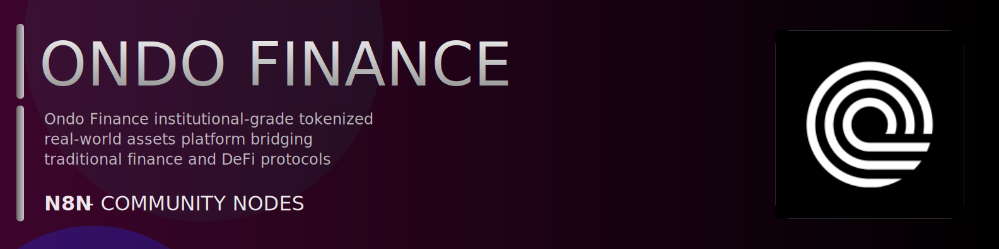

# @n8n-dev/n8n-nodes-ondo-finance



[](https://www.npmjs.com/package/@n8n-dev/n8n-nodes-ondo-finance)
[](https://opensource.org/licenses/MIT)

---

**Stop writing ondo-finance API integrations by hand.**

Every time you connect n8n to ondo-finance, you waste hours mapping endpoints, defining parameters, and debugging schemas. You copy-paste from docs, fix edge cases, and pray nothing breaks.

**What if connecting n8n to ondo-finance took 5 minutes, not half a day?**

This node gives you **6+ resources** out of the box: **Attestations**, **Assets**, **Tickers**, **Chains**, **Limits**, and 1 more: with full CRUD operations, typed parameters, and zero manual configuration.

---

## What You Get

- **Zero boilerplate**: Resources, operations, and fields are pre-configured and ready to use
- **Full CRUD**: Create, read, update, and delete support where the API allows it
- **Typed parameters**: No more guessing field types
- **Built-in auth**: API key authentication, ready to go
- **Declarative**: Native n8n performance, no custom execute() overhead

---

## Install

```bash
npm install @n8n-dev/n8n-nodes-ondo-finance
```

**Or in n8n:**
1. **Settings → Community Nodes → Install**
2. Search: `@n8n-dev/n8n-nodes-ondo-finance`
3. Click **Install**

---

## Quick Start

1. Install the node (above)
2. Add credentials: **ondo-finance API** → paste your API key
3. Drag the **ondo-finance** node into your workflow
4. Pick a resource → pick an operation → done.

That's it. No configuration files. No code. It just works.

---

## Resources

<details>
<summary><b>Attestations</b> (2 operations)</summary>

- Post Request a Mint or Redeem Attestation
- Post Request a Soft Attestation Quote

</details>

<details>
<summary><b>Assets</b> (11 operations)</summary>

- Get Current Prices for All Supported Assets
- Get Current Price for an Asset
- Get Enhanced Prices for All Supported Assets
- Get OHLC Open High Low Close Data for an Asset
- Get Market Data for All Supported Assets
- Get Market Data for an Asset
- Get Dividend Information for an Asset
- Get All Contract Addresses Across Networks
- Get Contract Addresses for an Asset
- Get Metadata for All Supported Assets
- Get Shares Multiplier History for an Asset

</details>

<details>
<summary><b>Tickers</b> (1 operations)</summary>

- Get Price and Volume Data for All Supported Tickers

</details>

<details>
<summary><b>Chains</b> (2 operations)</summary>

- Get Token Balances for a User or Token
- Get Token Info

</details>

<details>
<summary><b>Limits</b> (2 operations)</summary>

- Get Trading Limits
- Get Session Limits

</details>

<details>
<summary><b>Status</b> (2 operations)</summary>

- Get Current Market Status
- Get Asset Statuses

</details>

---

## Why This Node?

**Without this node:**
- Hours of manual API integration
- Copy-pasting from ondo-finance docs
- Debugging auth, pagination, error handling
- Maintaining your own client code

**With this node:**
- Install → configure → use. 5 minutes.
- Auto-generated from the official ondo-finance OpenAPI spec
- Always up to date when the API changes
- Native n8n performance

---

## Auto-Generated
This node was auto-generated from the official **ondo-finance** OpenAPI specification using
[@n8n-dev/n8n-openapi-node-ultimate](https://github.com/kelvinzer0/n8n-openapi-node-ultimate),
then validated against the live API so you get accurate types and real parameters, not guesswork.

When the ondo-finance API updates, this node updates too.

---


## License

MIT © [kelvinzer0](https://github.com/n8n-code)
